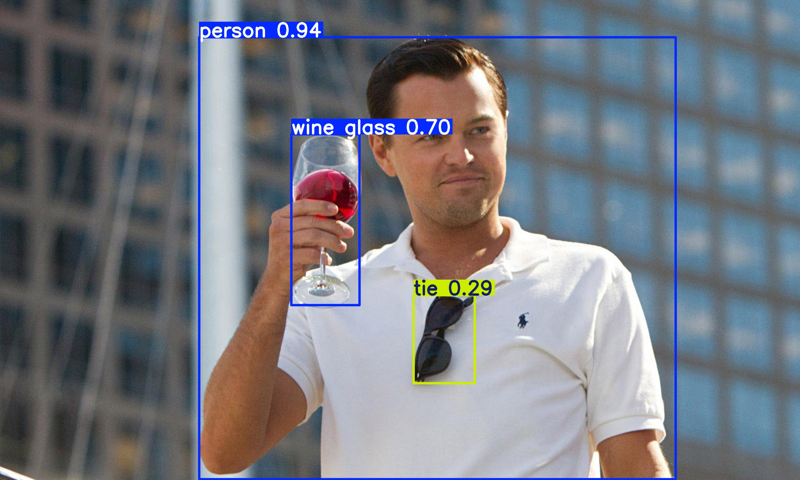

# Jetson Nano Yolo Demo

This is a demo of running ultralytics-YOLO on a Jetson nano. It uses a very minimal example to run the Yolov8 nano weights (~7 MB) on a picture of Leonardo DiCaprico with three distinct objects: A person, a wine glass, and a pair of sunglasses.



## Prerequisites

You must have prerequisite software installed on your Jetson Nano. These include:

1. OpenCV
2. Pytorch
3. Torchvision

Your Python version must be >= 3.8. You can follow this [guide by QEngineering](https://qengineering.eu/install-ubuntu-20.04-on-jetson-nano.html) to install the required software or simply install the [pre-built Ubuntu 20 image](https://github.com/Qengineering/Jetson-Nano-Ubuntu-20-image) with all the required software. 

After you have the prerequisite software installed, you must install ultralytics. Ultralytics comes packaged with YOLO which allows you run YOLO models. Use the command below to install:

```sh
pip install ultralytics
```

## Running the code

You simply have to run the Python file directly to get inference. This repo is already arranged such that the default specified model runs inference on the included image automatically. The results are saved to the `saves/` sub directory. So go ahead and run your project using the command below:

```sh
python main.py
```

You should get an output similar to:

```sh
image 1/1 /home/jetson/yolovproject/testimages/leonardo.jpg: 384x640 1 person, 1 tie, 1 wine glass, 158.5ms
Speed: 109.1ms preprocess, 158.5ms inference, 192.6ms postprocess per image at shape (1, 3, 384, 640)
```

It wrongly identifies the sunglasses as a tie tho, 😅.